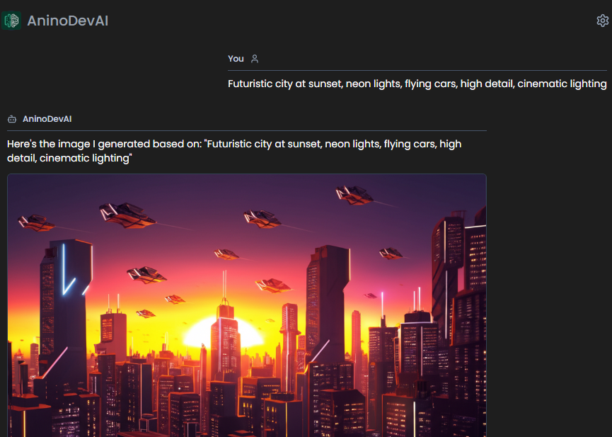

# AninoDevAI - Voice AI Assistant
An AI assistant that lets you talk naturally and create images. It uses voice commands to chat, can generate images on demand, and even convert images into code. Built with Google's Gemini AI for both conversation and image creation

<div align="center" style="display: flex; justify-content: center; gap: 20px;">
  
</div>

## Sample AI Image Generation Results
<div align="center" style="display: flex; justify-content: center; gap: 20px;">
 
  
</div>


## Features
- Voice input/output
- Real-time speech recognition
- AI-powered responses
- Custom voice selection
- Mobile responsive design

## Tech Stack
- React + TypeScript
- Vite
- TailwindCSS
- shadcn/ui
- Google Gemini API
- Vapi AI SDK
- Browser Speech API
- Framer Motion
- TanStack Query
- React Router

## Setup

1. Clone the repository:
```bash
git clone https://github.com/BryanLomerio/AninoDevAi.git
cd AninoDevAi
```

2. Install dependencies:
```bash
npm install
```

3. Create `.env` file in root:
```env
VITE_GEMINI_API_KEY=your_gemini_api_key
```

4. Start development server:
```bash
npm run dev
```

Visit `http://localhost:8080`

## Build

```bash
npm run build
```

## Requirements
- Node.js 16+
- Modern web browser with speech recognition support
- Gemini API key
- Vapi API key 
